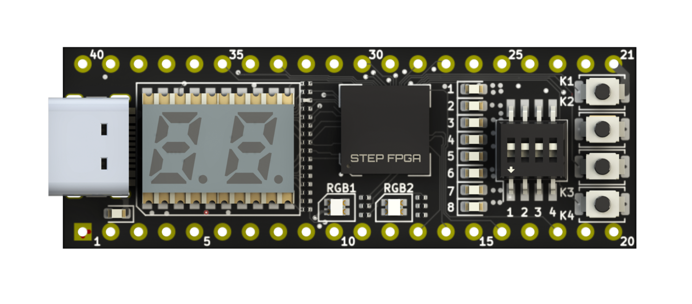

# STEP FPGA simple calc

A rudimentary hex RPN calculator for the [STEP FPGA development board](https://shop.eimtechnology.com/products/step-fpga-development-board).

The calculator has two 8-bit registers (A and B) and can perform only one operation - addition.

The inputs and outputs supposed to be assigned to the controls the following way:

- 7-segment leds always display A register content;
- Enter 4-bit number using dip-switches;
- K4 button latches the dip-switch value into the A register;
- K3 button copies A to B;
- K3 button sums A and B and puts result to A;
- K1 button clears A and B.

